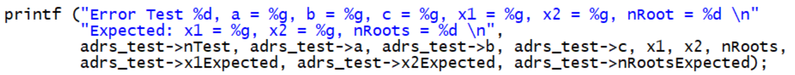

# SquareSolver

_SquareSolver_ - проект, позволяющий решать квадратные уравнения с заданными коэффициентами:

*  всего за пару секунд при вводе трёх коэффициентов выдаёт готовое решение

*  экономит ваше время при решении скучных домашних заданий

*  гораздо эффективнее любых калькуляторов и приложений для школьников

*  доступен для использования на CodeBlocks и VSCode


## Фичи программы

*  встроены функции __InputData__ и __CleanAndCheckBuffer__ для безопасного ввода данных

*  обеспечена возможность проверки корректности работы программы через запуск тестов
	   (функция __RunTest__)

*  также возможно подключение файлов с произвольным набором тестов в функцию __CheckAllTests__


## Компиляция файлов
	
	1. Открываем командную строку.

	2. Указываем путь для папки с проектом.

	3. Далее возможны 2 варианта:		
*  совместная компиляция через команду 
			
```bash
g++ main1.cpp Solving1.cpp Tests1.cpp -o main1.exe
main1.exe
```

*  раздельная компиляция
		


## Запуск тестов
```bash
g++ -D DEBUG main1.cpp Solving1.cpp Tests1.cpp -o main1.exe
main1.exe
```


## Как обеспечивается отсутствие программных ошибок?
	
*  есть функция безопасного сравнения чисел с помощью константы __Eps__ 

*  есть конструкция __assert__ для безопасной работы с указателями
	
*  в случае ошибок в написании кода функция __PrintRoots__ предупреждает пользователя

*  на случай ошибок при проверке тестов предусмотрен вывод данных для визуализации 
		



